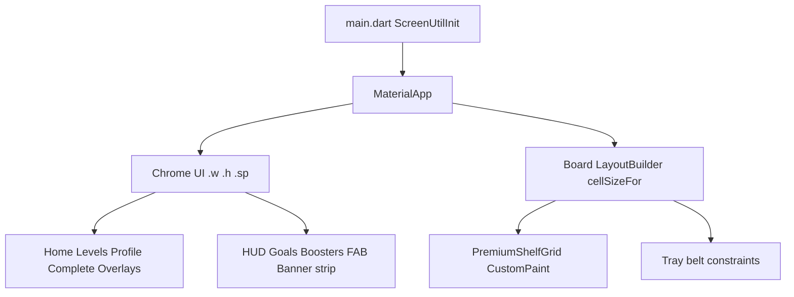

# Responsive UI with flutter_screenutil

## Widget inventory (complete)

### Active screens (live nav)
- [splash_screen.dart](lib/ui/screens/splash_screen.dart) — splash → home
- [home_shell.dart](lib/ui/screens/home_shell.dart) — home hub
- [levels_screen.dart](lib/ui/screens/levels_screen.dart) — level select
- [level_intro_sheet.dart](lib/ui/screens/level_intro_sheet.dart) — launch level
- [premium_gameplay_screen.dart](lib/ui/premium/premium_gameplay_screen.dart) — live gameplay shell
- [level_complete_screen.dart](lib/ui/screens/level_complete_screen.dart) — win/lose
- [profile_screen.dart](lib/ui/screens/profile_screen.dart) — profile/settings
- [asmr_mode_screen.dart](lib/ui/screens/asmr_mode_screen.dart) — ASMR mode

### Premium gameplay widgets
- [premium_hud.dart](lib/ui/premium/premium_hud.dart), [premium_goal_panel.dart](lib/ui/premium/premium_goal_panel.dart), [premium_toolbar.dart](lib/ui/premium/premium_toolbar.dart)
- [premium_shelf_grid.dart](lib/ui/premium/premium_shelf_grid.dart) — **board (already constraint-responsive)**
- [premium_tray_belt.dart](lib/ui/premium/premium_tray_belt.dart), [premium_tray_plank.dart](lib/ui/premium/premium_tray_plank.dart)
- [premium_tokens.dart](lib/ui/premium/premium_tokens.dart), [premium_goods_fx.dart](lib/ui/premium/premium_goods_fx.dart)
- [premium_cupboard.dart](lib/ui/premium/premium_cupboard.dart), [modular_cupboard_painter.dart](lib/ui/premium/modular_cupboard_painter.dart), [cupboard_catalog.dart](lib/ui/premium/cupboard_catalog.dart)
- [toy_item_widget.dart](lib/ui/premium/toy_item_widget.dart), [board_drag.dart](lib/ui/premium/board_drag.dart), [face_images.dart](lib/ui/premium/face_images.dart), [premium_wood_cell.dart](lib/ui/premium/premium_wood_cell.dart), [premium_room_background.dart](lib/ui/premium/premium_room_background.dart), [premium_demo_data.dart](lib/ui/premium/premium_demo_data.dart)

### Shared widgets / meta / overlays
- [goods_sort_gameplay_ui.dart](lib/ui/widgets/goods_sort_gameplay_ui.dart) — pause/lose overlays (used live)
- [gift_box_fab.dart](lib/ui/widgets/gift_box_fab.dart), [ad_banner_widget.dart](lib/ui/widgets/ad_banner_widget.dart), [common_widgets.dart](lib/ui/widgets/common_widgets.dart)
- [mechanic_widgets.dart](lib/ui/widgets/mechanic_widgets.dart), [pixel_shelf.dart](lib/ui/widgets/pixel_shelf.dart), [cupboard_board.dart](lib/ui/widgets/cupboard_board.dart), [goods_emoji.dart](lib/ui/widgets/goods_emoji.dart)
- [meta_chrome.dart](lib/ui/meta/meta_chrome.dart), [praise_burst.dart](lib/ui/meta/praise_burst.dart)

### Orphan / unused (still convert for consistency)
- [gameplay_screen.dart](lib/ui/screens/gameplay_screen.dart), [shop_screen.dart](lib/ui/screens/shop_screen.dart), [daily_rewards_screen.dart](lib/ui/screens/daily_rewards_screen.dart), [tutorial_overlay.dart](lib/ui/screens/tutorial_overlay.dart), [mechanic_tutorial.dart](lib/ui/screens/mechanic_tutorial.dart), [tool_bar.dart](lib/ui/widgets/tool_bar.dart), [store_background.dart](lib/ui/widgets/store_background.dart)

### Theme (fonts only where literal sizes exist)
- [app_theme.dart](lib/app/theme/app_theme.dart)

---

## Chosen library + approach

**Library:** [`flutter_screenutil`](https://pub.dev/packages/flutter_screenutil) — Flutter ka sab se common / standard design-size scaler (`.w` / `.h` / `.sp` / `.r`).

**Design size:** `Size(390, 844)` — already matches live HUD scale (`w / 390` in [premium_hud.dart](lib/ui/premium/premium_hud.dart)).

**Hard rule (no game change):**
- **Do NOT** wrap board geometry in ScreenUtil: `PremiumShelfGrid.cellSizeFor`, CustomPaint hit-tests, tray belt constraint math, ASMR board `LayoutBuilder`.
- **Do** scale chrome: paddings, fonts, button sizes, logos, overlays, FABs, HUD/goal/toolbar literals.
- Replace HUD/goal manual `(w/390)` / `(w/280)` clamps with ScreenUtil so scale is single-source (avoids double-scaling).
- Engine / bloc / match logic / ads behavior untouched.

---

## Implementation steps

1. **Dependency + bootstrap**
   - Add `flutter_screenutil` to [pubspec.yaml](pubspec.yaml).
   - Wrap app in [main.dart](lib/main.dart) with `ScreenUtilInit(designSize: Size(390, 844), minTextAdapt: true, splitScreenMode: true, builder: ...)`.

2. **Central tokens**
   - Scale layout consts in [premium_tokens.dart](lib/ui/premium/premium_tokens.dart) and [goods_sort_gameplay_ui.dart](lib/ui/widgets/goods_sort_gameplay_ui.dart) `GoodsSortLayout` via getters that use `.h`/`.w` (or call sites use `.w`/`.h`) — banner reserved height stays ad-safe but UI offset uses scaled spacing.

3. **Active chrome pass (priority)**
   - Home / levels / profile / splash / complete / intro / ASMR chrome.
   - Premium HUD, goal panel, toolbar, gift FAB, common widgets, meta chrome, pause/lose overlays, praise burst.
   - Convert literal `fontSize`, `EdgeInsets`, `SizedBox`, icon boxes, radii to `.sp` / `.w` / `.h` / `.r`.

4. **Gameplay shell only (not board math)**
   - [premium_gameplay_screen.dart](lib/ui/premium/premium_gameplay_screen.dart): padding around board area, overlay dialogs; held-ghost size stay visually consistent by deriving from current cell width when available, else `62.w` — no drag/match logic change.
   - Leave [premium_shelf_grid.dart](lib/ui/premium/premium_shelf_grid.dart) `cellSizeFor` / hit-test path as-is.

5. **Orphan screens / legacy widgets**
   - Same ScreenUtil conversion so unused UIs don’t regress if re-linked later.

6. **Verify (no behavior change)**
   - `flutter analyze` clean on touched files.
   - Mentally / code-check: level start, drag/drop, boosters, ads banner strip, gift FAB, level complete navigation unchanged.

---

## Out of scope
- No visual redesign (no new shadows/gradients/animations).
- No gameplay / scoring / ad-fill / network logic changes.
- No inventing AdMob IDs or ads skill rework beyond existing banner height token usage.
